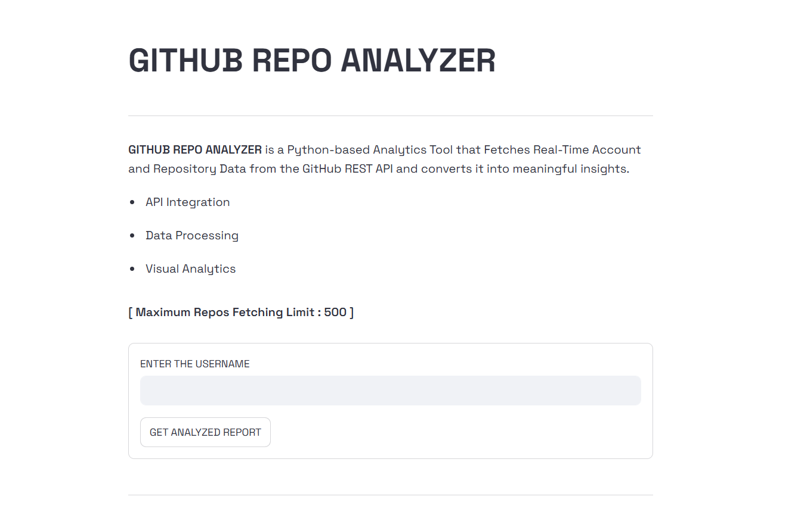
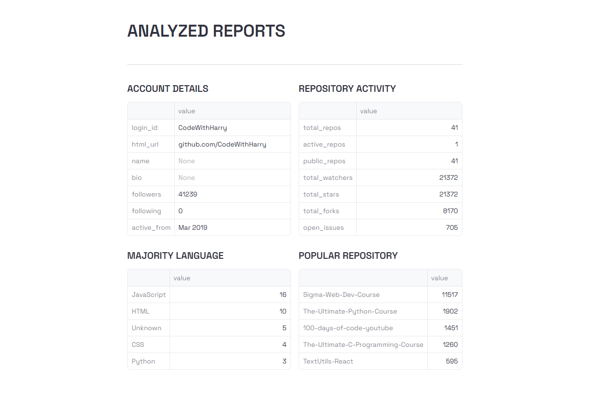
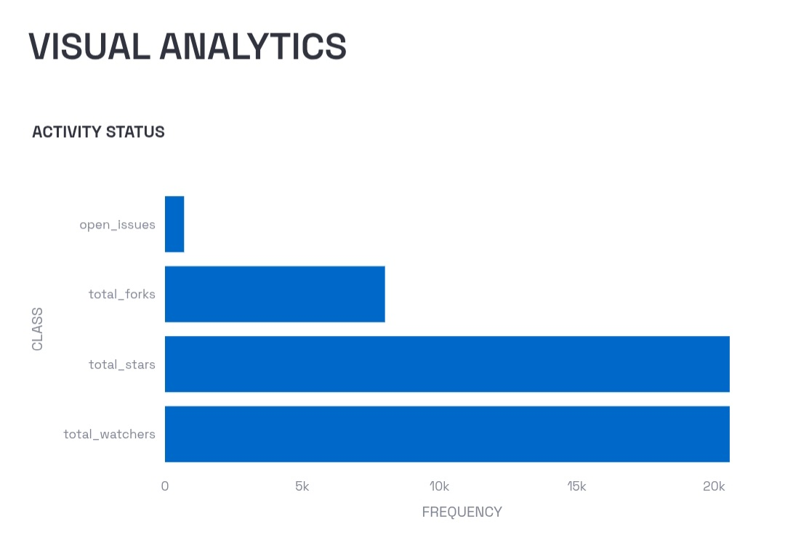
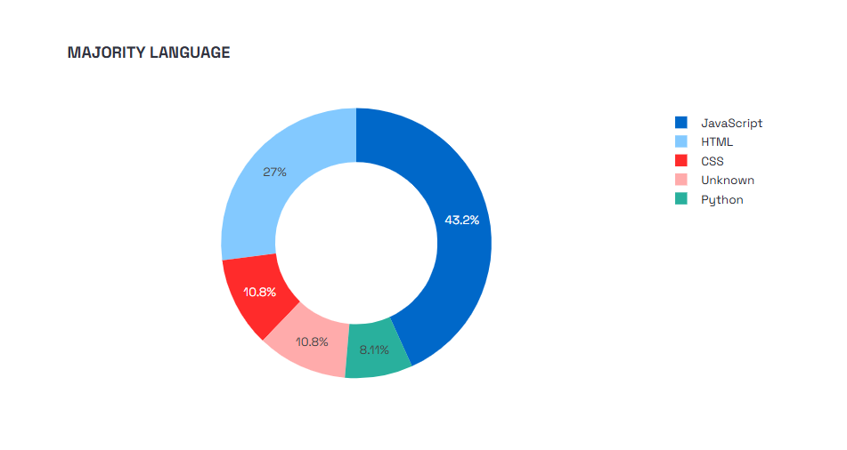
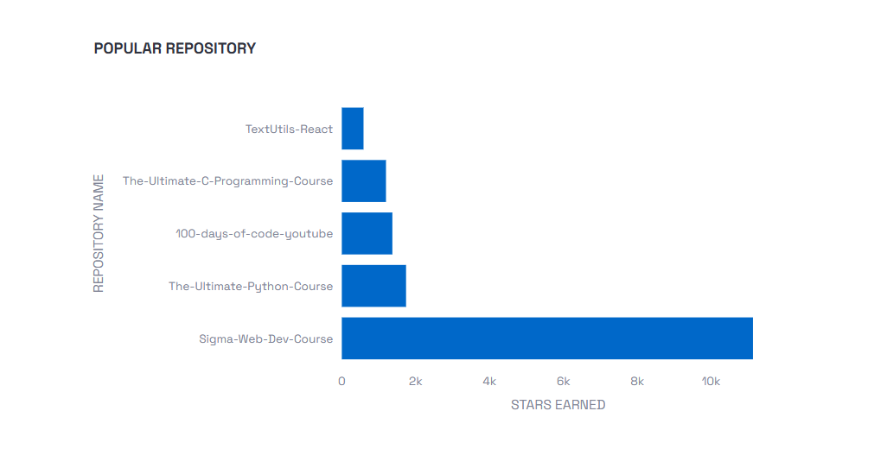

# GitHub Repo Analyzer - Python

## Dashboard View 
- App's User Interface

- Analyzed Report through Github API.

- Complete Account Analysis using Matplotlib.

## Table of Contents
- [Dashboard View](#dashboard-view)
- [Introduction](#introduction)
- [Features](#features)
- [Technical Stack Used](#technical-stack-used)
- [Author and Links](#author-and-links)

## Introduction
`GitHub Repository Analyzer` is a Python-based analytics tool that fetches real-time repository data from the GitHub REST API and converts it into meaningful insights.  
The project focuses on `API integration`, `Data Processing`, and `Visual Analytics` to evaluate a GitHub user’s repository activity, popularity, and technology usage.

This project demonstrates real-world usage of:
- REST APIs
- Exception handling
- Data Aggregation
- Graphical Visualization

## Features
### GitHub API Data Fetching
- Fetches repository data using GitHub REST API
- User Account API : `https://api.github.com/users/<username>/`
- User Repositories API : `https://api.github.com/users/<username>/repos/`

- Handles:
  - Invalid usernames
  - API rate limits
  - Request timeouts
- Uses structured exception handling

### Repository Statistics Analysis
Calculates:
- Total repositories
- Public and private repositories
- Active and stale repositories
- Total stars, forks, watchers, and open issues

### Language Usage Analysis
- Extracts programming languages used across repositories
- Identifies the majority language
- Handles missing or null language values

### Popularity Insights
- Identifies the most starred repository
- Calculates stars per repository
- Highlights top repositories based on popularity

### Graphical Visualization
Provides professional visualizations using Matplotlib:
- Popularity metrics comparison
- Repository status overview
- Language distribution (donut chart)
- Stars per repository (top repositories)

## Technical Stack Used
| Component | Technology |
|--------|------------|
| Programming Language |  python3  |
| API Handling |  requests  |
| UI Integration |  streamlit  |
| Date & Time Processing |  datetime  |
| Visualization |  plotly  |
| Data Source |  GitHub APIs  |

## Author and Links
Designed and created by `Tanishk Bhatt` a Student and a Programmer of India, as a real world working project using API Handling and Visualisation.

---
