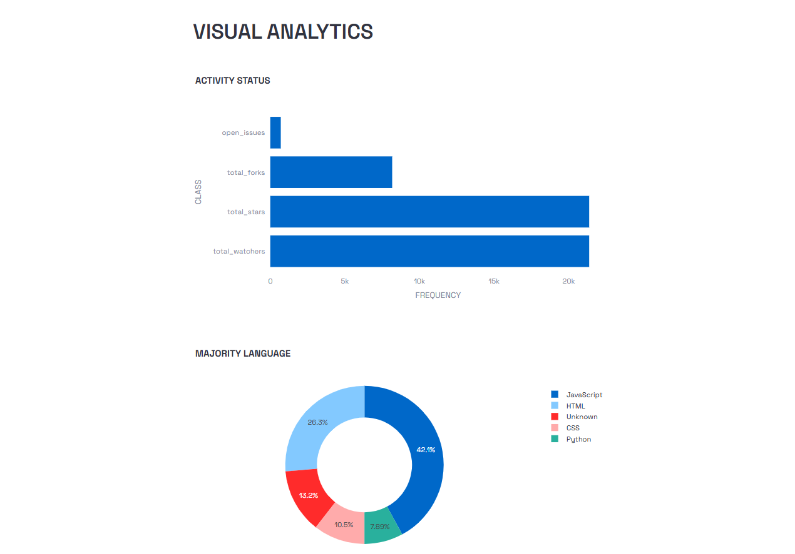

# GitHub Repo Analyzer

Github Repo is an Analysing Tool that Automates Repository and Account Analysis by Extracting Useful Metrics and Contribution Insights through Github RESTAPIs.

## Features
- Fetches latest account insights from Github RESTful API services.
- Analyze the data effectively and generate an account summary report.
- Interactive visualizations are provided for every account.
- Minimal and efficient UI using Streamlit.
- Best for beginner's open source contribution.

## Tech Stack

| Component          | Role             |
| ------------------ | ---------------- |
| Python             | Primary language |
| Streamlit          | UI Integration   |
| Requests           | API requests     |
| Plotly             | Visuals          |
| Github RESTful API | Data fetching    |

## Screenshots

## Contributing
1. Fork the repository
2. Create a feature branch
3. Clone locally and add some values
4. Commit changes
5. Push and create a pull request

- If your contribution adds some value to the project, your branch will be merged into the main branch.

## Author
Tanishk Bhatt - A Student and A Programmer

---