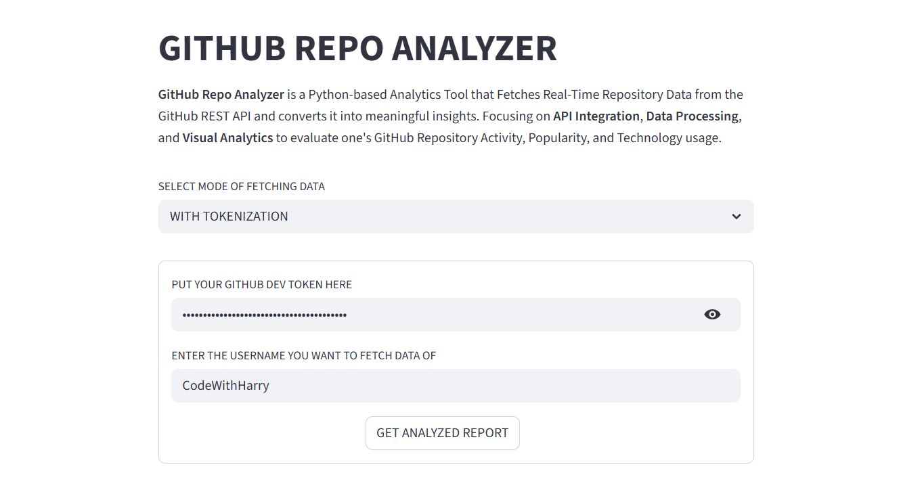
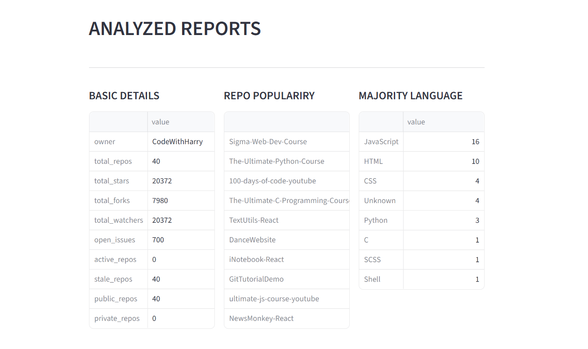
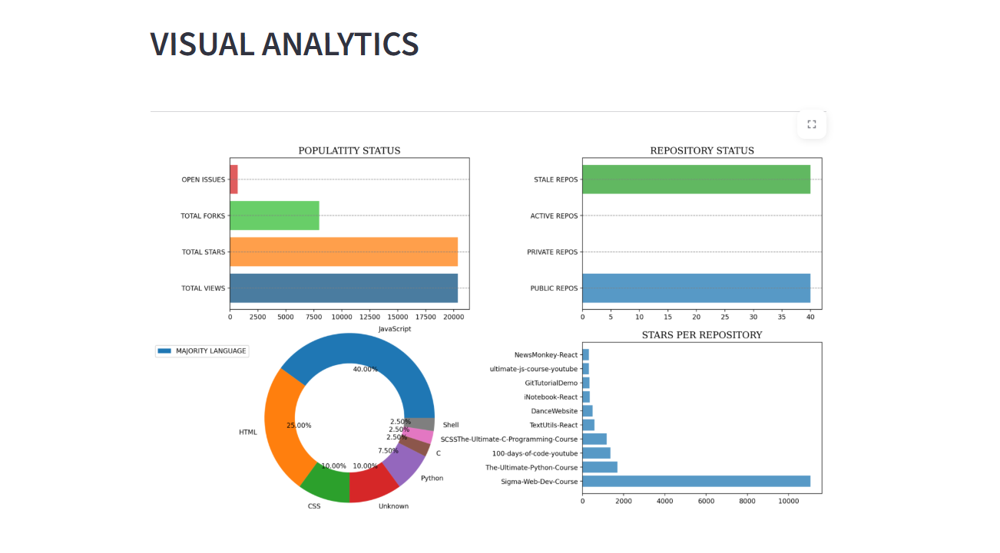
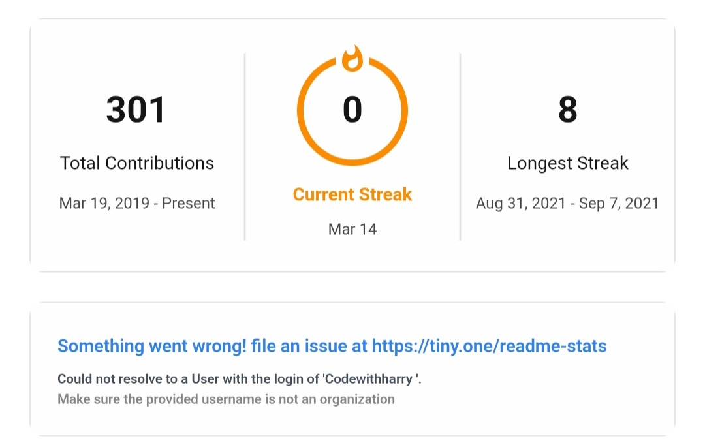

# GitHub Repo Analyzer - Python

## Dashboard View
- App's User Interface



- Analyzed Report through Github API.



- Complete Account Analysis using Matplotlib.



- Other Key Performance Analysis through Vercel APIs.



## Introduction
`GitHub Repository Analyzer` is a Python-based analytics tool that fetches real-time repository data from the GitHub REST API and converts it into meaningful insights.  
The project focuses on `API integration`, `Data Processing`, and `Visual Analytics` to evaluate a GitHub user’s repository activity, popularity, and technology usage.

This project demonstrates real-world usage of:
- REST APIs
- Exception handling
- Data Aggregation
- Graphical Visualization

## Table of Contents
- [Introduction](#introduction)
- [Features](#features)
- [Technical Stack Used](#technical-stack-used)
- [How to Run the Project](#how-to-run-the-project)
- [Author and Links](#author-and-links)

---

## Features
### GitHub API Data Fetching
- Fetches repository data using GitHub REST API
- API URL : `https://api.github.com/users/<username>/repos`
- Handles:
  - Invalid usernames
  - API rate limits
  - Request timeouts
- Uses structured exception handling

### Repository Statistics Analysis
Calculates:
- Total repositories
- Public and private repositories
- Active and stale repositories
- Total stars, forks, watchers, and open issues

### Language Usage Analysis
- Extracts programming languages used across repositories
- Identifies the majority language
- Handles missing or null language values

### Popularity Insights
- Identifies the most starred repository
- Calculates stars per repository
- Highlights top repositories based on popularity

### Graphical Visualization
Provides professional visualizations using Matplotlib:
- Popularity metrics comparison
- Repository status overview
- Language distribution (donut chart)
- Stars per repository (top repositories)


## Technical Stack Used
| Component | Technology |
|--------|------------|
| Programming Language | `python` |
| API Handling | `requests` |
| UI Integration | `streamlit` |
| Date & Time Processing | `datetime` |
| Visualization | `matplotlib` |
| Data Source | `GitHub and Vercel APIs` |


## How to Run the Project?

### 1. Visit the Web-Page
- Directly Visit the Webpage hosted on Streamlit Cloud Hosting Site.

- Link : https://github-repo-analyzer-tanishkbhatt.streamlit.app

- Generate a Github Developer's TOKEN through your Github Account and put it there.

- Enter the Username and Analyze.

### 2. Clone the Repository
- Clone the Repository and run locally on your system
```bash
git clone https://github.com/TanishkBhatt/Github-Repo-Analyzer.git
```
### Install Required Libraries
```bash
pip install -r requirements.txt
```
### Run the Script
```bash
streamlit run app.py
```
#### The program will generate:

- A detailed GitHub profile analysis report
- Multiple graphical visualizations

## Author and Links
Designed and created by `Tanishk Bhatt` a Student and a Programmer of India, as a real world working project using API Handling and Visualisation.

- Protfolio : https://tanishkbhatt.github.io/TanishkBhatt
- Github : https://github.com/TanishkBhatt/

---
